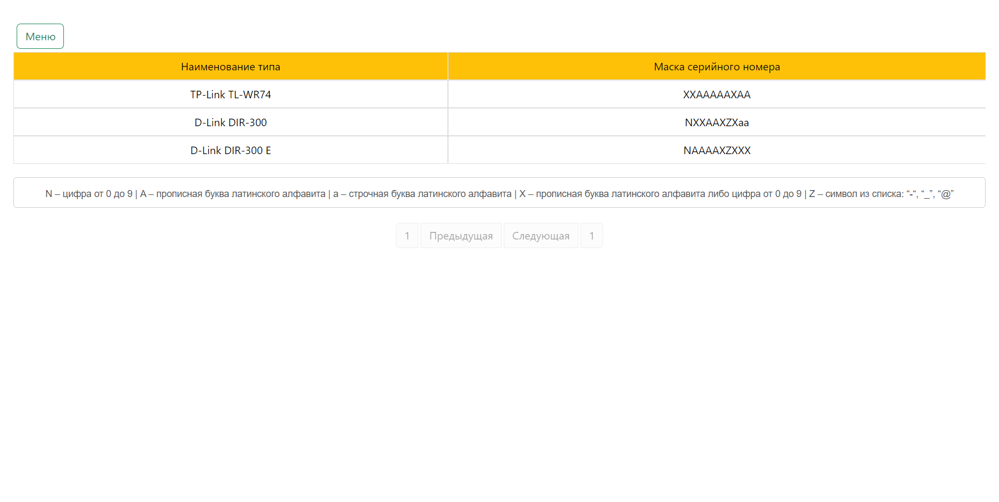
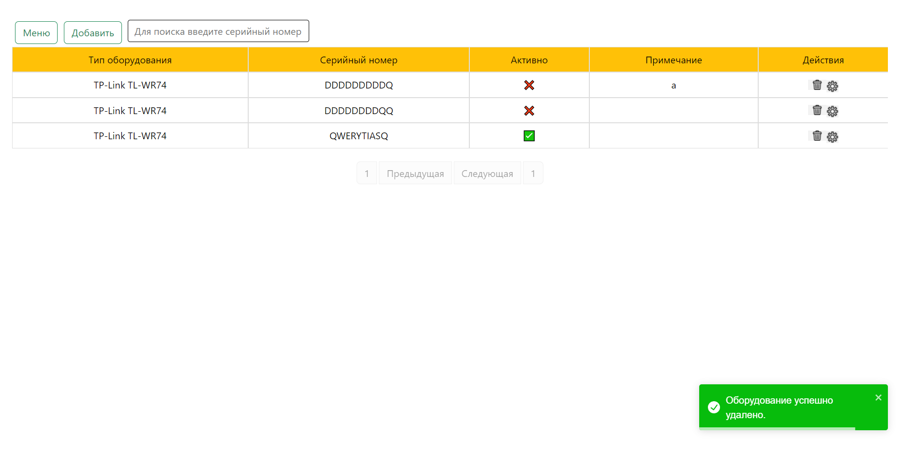

# Тестовое задание

## Описание Проекта
Проект состоит из двух частей: Backend и Frontend. Backend реализует REST API для работы с сущностью "оборудование". Frontend представляет SPA (Single Page Application), работающее с созданным API.

### Backend
В этой части проекта реализован REST API с использованием фреймворка Django. API предоставляет возможности для выполнения различных действий с оборудованием:

- [x] Получение пагинированного списка оборудования
- [x] Запрос данных по ID оборудования
- [x] Создание новых записей
- [x] Редактирование записей
- [x] Удаление записей (мягкое удаление)
- [x] Получение пагинированного списка типов оборудования
- [x] Авторизация пользователя при выполнении запросов через JWT токен
- [x] Наличие Docstring для всех методов
- [x] Инкапсуляция бизнес-логики в моделях и сервисном слое

### Frontend
В данной части проекта создано минимальное SPA-приложение на Vue.js. Оно работает с разработанным REST API для обеспечения интерфейса пользователя. Основные функциональности включают:

- [x] Форма добавления записей
- [x] Форма(ы) поиска, редактирования и удаления записей
- [x] Минимальная валидация данных на стороне клиента
- [x] Использование UI-китов для дизайна пользовательского интерфейса

### Используемые технологии
- Python 3.10
- Django
- Vue.js
- MySQL
- Регулярные выражения (для валидации масок)

## Установка и Запуск
### Запуск backend
- ```python manage.py makemigrations``` - создать миграции
- ```python manage.py migrate``` - применить миграции
- ```pip install -r requirements.txt``` - установить зависимости
- ```python manage.py runserver``` - запустить сервер
### Запуск frontend
- ```cd .\frontend\equip_frontend\``` - перейти в папку проекта
- ```npm i``` - установить зависимости
- ```npm run dev``` - запустить фронтенд
## Документация API
Вся необходимая документация доступна в Swagger. Валидация масок для серийных номеров выполняется на основе предоставленных данных, где каждая буква или символ имеют свое ограничение.
## Скриншоты







